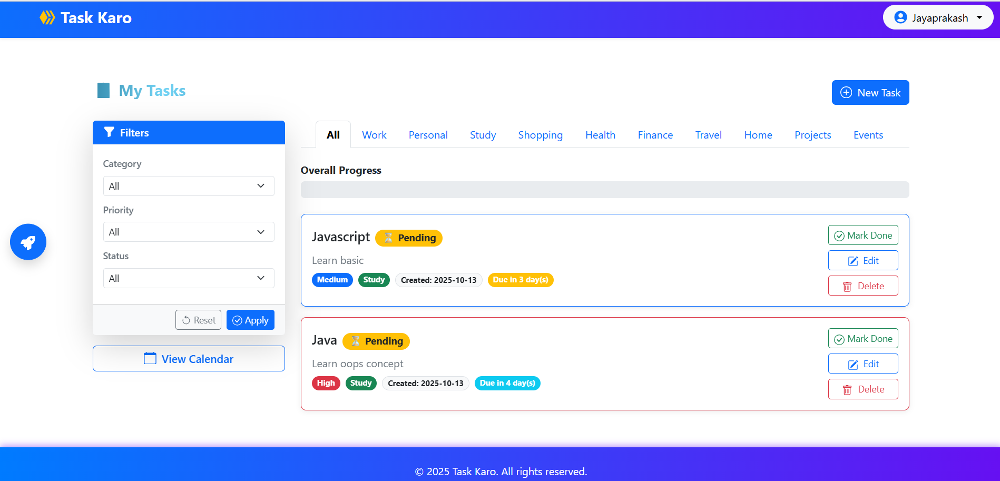
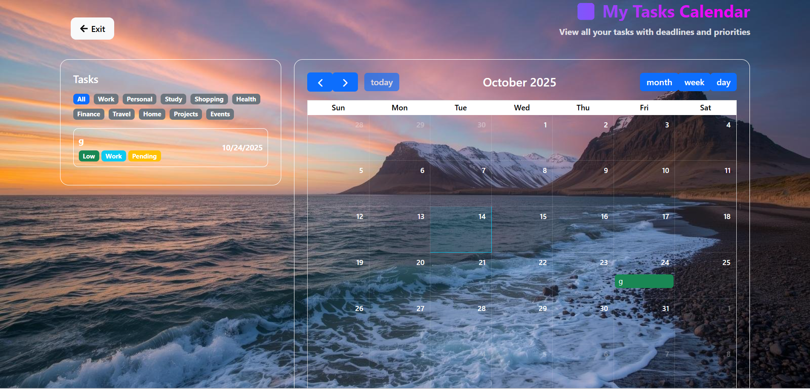

# 📝 Task Karo - Your Simple Task Manager

**Task Karo** is a minimal, fast, and feature-rich **MERN stack** to-do list application that helps users efficiently manage their daily tasks. Organize tasks with categories, priorities, and status tracking to boost your productivity.  [MERN]Stack.....

🔗 **Live Demo:** [https://your-live-demo-link.com](https://your-live-demo-link.com)  

---

## 🚀 Features

- **User Authentication:** Secure login and logout system.  
- **Task Management:** Create, view, update, and delete tasks.  
- **Filtering & Sorting:** Filter tasks by category (Work, Personal, Study, etc.), priority (High, Medium, Low), and status (Pending, Done).  
- **Responsive UI:** Works seamlessly on desktop and mobile devices.  
- **Progress Tracking:** Visualize overall task completion with a progress bar or chart.  
- **widget:** Streaks,Mood Tracker,AI insights,suduko game,Graph [pie chart,bar graph]. 
- **widget:** Calender view task on that day & date.

---

## 💻 Technology Stack

| Technology       | Purpose                                   |
|-----------------|-------------------------------------------|
| **Frontend**     | React (via Vite)                          |
| **Backend**      | Node.js + Express                         |
| **Database**     | MongoDB                                   |
| **Styling/UI**   | Bootstrap 5                               |
| **State Mgmt**   | React Context API                         |
| **Icons**        | React Icons (react-icons/fa)              |
| **Authentication** | Custom implementation via AuthContext  |

---

## 📂 Folder Structure

This project follows a standard Monorepo structure, separating the WEB (Frontend) and SERVER (Backend) into distinct folders.

task-karo/
├── server/                             # Node.js / Express Backend
│   ├── src/
│   │   ├── config/                     # Environment configuration, DB connections
│   │   ├── controllers/                # Core API logic (handles request/response)
│   │   ├── middlewares/                # Functions for request pre-processing (auth checks, CORS)
│   │   ├── models/                     # MongoDB/Mongoose Schemas
│   │   ├── routes/                     # API routes definition (e.g., /api/tasks)
│   │   ├── validators/                 # Input validation logic
│   │   └── server.js                   # Main application entry point
│   ├── .env                            # Backend environment variables (e.g., PORT, DB_URI)
│   └── package.json
│
├── web/                                # React / Vite Frontend
│   ├── src/
│   │   ├── api/                        # Custom hooks or functions for API calls (e.g., fetchTasks)
│   │   ├── assets/                     # Static files (images, fonts)
│   │   ├── components/                 # Reusable UI components (Navbar, TaskCard, etc.)
│   │   ├── context/                    # Central state management (AuthContext, TaskContext)
│   │   ├── pages/                      # Main views (Login, Register, Dashboard)
│   │   ├── utils/                      # Helper functions (date formatting, general utilities)
│   │   ├── App.jsx                     # Main React application component
│   │   └── main.jsx                    # Root file (React DOM mounting)
│   ├── .env                            # Frontend environment variables (e.g., VITE_API_URL)
│   ├── index.html
│   └── vite.config.js
│
├── .gitignore
└── README.md                           # This file

### Screenshots

**Login Page**

**Dashboard**

**Calender**

**Graph**

**Streak**

# Backend
cd server
npm install
npm start

# Frontend
cd web
npm install
npm run dev

